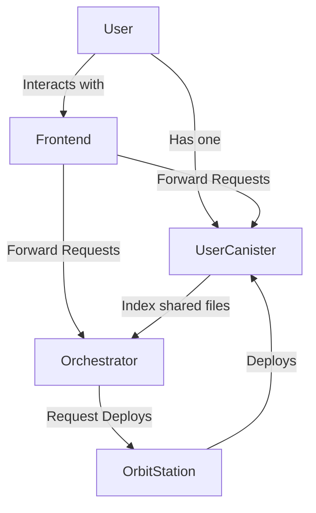

# How Docutrack is implemented?

The Docutrack architecture consists of the following components:

- **Orchestrator**: The orchestrator canister is the coordinator of the dapp. It manages the user registration to create the user and the organizations data and storage canisters. It also indexes the shared documents for each user to each canister the file belongs to, to provide user a fast access to the shared documents. It provides the following functionality:

  - Register a new user
  - Register a new organization (only subscribed users)
  - Deploy the user or organization canister
  - Index a shared document (only callable from the user or organization canister)
  - Remove a shared document from the index (only callable from the user or organization canister)
  - Trigger Email verification challenge
  - Handle user / organization canister upgrades

- **User Canister**: The user canister is the main canister for a user. It serves as a storage for the user's documents and user configurations, a unique user-side resource of truth and provides the following functionality:

  - Upload a Document
  - Create a request for a document upload on the user behalf
  - Share a document with another user or organization
  - Revoke access to a shared document
  - Re-generate shared decryption keys
  - Enables file upgrades and file signatures (e-sign)
  - List all shared documents
  - List files
  - Explore the file tree of the storage
  - Path mapping and configuration
  - Download a document
  - Delete a document

- **Organization Canister**: The organization canister is similar to the user canister, but it is used for organizations. It extends the functionality of the user canister, and enables multi-user and role based registry whithin the organization. It Provides a richer experience for interactions whithin the organization scope.
  Organization users may or may not have a personal user canister.

- **Orbit station**: The orbit station canister is implemented by the DFINITY Foundation and is used to securely and reliably deploy the user canisters and handle automatically the canister upgrades and the cycles management.

- **Frontend**: The frontend is a web application that provides the user interface for the dapp. It is implemented using React and communicates with the canisters using the Internet Computer's HTTP API.
