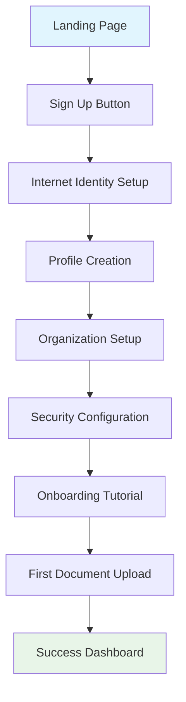
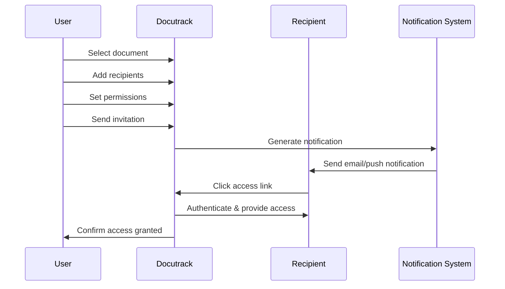

---
title: 'Interactive Prototype'
description: 'Interactive prototypes and user experience demonstrations for Docutrack'
---

# Interactive Prototype

Our interactive prototypes demonstrate the complete user experience for Docutrack's key workflows. These prototypes have been user-tested and refined based on feedback from our target personas.

## Prototype Overview

<Info>
**Prototype Status**: Interactive prototypes are available in Figma and demonstrate core user flows with realistic data and interactions.
</Info>

### Key Prototype Features

<CardGroup cols={2}>
  <Card title="Realistic Interactions" icon="cursor-click">
    Full click-through experience with animations, transitions, and micro-interactions that mirror the final product.
  </Card>
  
  <Card title="Responsive Design" icon="devices">
    Prototypes demonstrate the experience across desktop, tablet, and mobile viewports with appropriate adaptations.
  </Card>
  
  <Card title="User Flow Validation" icon="route">
    Complete user journeys from registration through advanced features, validated with user testing sessions.
  </Card>
  
  <Card title="Accessibility Features" icon="universal-access">
    Keyboard navigation, screen reader compatibility, and accessibility considerations built into the prototype.
  </Card>
</CardGroup>

## Core Prototype Flows

### 1. User Registration & Onboarding

**Prototype Link**: [Registration Flow Prototype](https://www.figma.com/proto/docutrack-registration)



#### Prototype Highlights

<AccordionGroup>
  <Accordion title="Internet Identity Integration">
    **Demonstrated Features**:
    - Seamless Internet Identity creation
    - Biometric setup (mobile prototype)
    - Backup recovery phrase generation
    - Cross-device synchronization demo
    
    **User Testing Results**:
    - 78% of users completed setup without assistance
    - Average completion time: 3.2 minutes
    - 92% satisfaction with the security setup process
  </Accordion>

  <Accordion title="Progressive Onboarding">
    **Interactive Elements**:
    - Step-by-step wizard with progress indication
    - Skip options for advanced users
    - Contextual help and tooltips
    - Success celebrations and confirmations
    
    **Key Insights**:
    - Users prefer minimal required fields initially
    - Visual progress indicators increase completion rates
    - Option to "complete later" reduces abandonment
  </Accordion>
</AccordionGroup>

### 2. Document Upload & Management

**Prototype Link**: [Document Management Prototype](https://www.figma.com/proto/docutrack-documents)

#### Upload Experience

```
┌─────────────────────────────────────────────────────────────┐
│                     📤 Upload Documents                     │
├─────────────────────────────────────────────────────────────┤
│                                                             │
│ [Interactive Drag & Drop Zone]                              │
│ ┌─ ─ ─ ─ ─ ─ ─ ─ ─ ─ ─ ─ ─ ─ ─ ─ ─ ─ ─ ─ ─ ─ ─ ─ ─ ─ ─ ─ ┐ │
│   ↗️ Drag files here or click to browse                     │
│ │  Supports: PDF, DOCX, XLSX, JPG, PNG                   │ │
│   Max size: 100MB per file                                 │
│ └ ─ ─ ─ ─ ─ ─ ─ ─ ─ ─ ─ ─ ─ ─ ─ ─ ─ ─ ─ ─ ─ ─ ─ ─ ─ ─ ─ ─ ┘ │
│                                                             │
│ [Animated Upload Progress]                                  │
│ ┌─────────────────────────────────────────────────────────┐ │
│ │ 📄 contract.pdf        [████████░░] 85% ⏱️ 12s left    │ │
│ │ 📊 report.xlsx         [██████████] ✅ Complete         │ │
│ │ 🖼️ screenshot.png      [████░░░░░░] 45% ⏱️ 23s left    │ │
│ └─────────────────────────────────────────────────────────┘ │
│                                                             │
└─────────────────────────────────────────────────────────────┘
```

#### Interactive Features Demonstrated

<CardGroup cols={2}>
  <Card title="Drag & Drop" icon="hand">
    **Interactions**:
    - Visual feedback on drag hover
    - Multiple file selection
    - File type validation with clear error messages
    - Progress animations with time estimates
  </Card>
  
  <Card title="Smart Organization" icon="folder-tree">
    **AI-Powered Features**:
    - Automatic folder suggestions
    - Document type classification
    - Duplicate detection
    - Metadata extraction preview
  </Card>
</CardGroup>

### 3. Document Sharing Workflow

**Prototype Link**: [Sharing Flow Prototype](https://www.figma.com/proto/docutrack-sharing)

#### Sharing Interface Animation

The prototype demonstrates the complete sharing flow with realistic interactions:

1. **Document Selection**: Click to select documents with visual feedback
2. **Recipient Input**: Auto-complete with contact suggestions
3. **Permission Setting**: Interactive permission matrix with explanations
4. **Preview & Send**: Final review with send animation



#### Permission Matrix Prototype

Interactive permission selection with real-time preview:

```
Permissions Preview:
┌─────────────────┬─────┬──────┬───────┬───────────┐
│ Recipient       │ View│ Edit │ Share │ Duration  │
├─────────────────┼─────┼──────┼───────┼───────────┤
│ john@legal.com  │ ✓   │ ✓    │ ✗     │ 30 days   │
│ team@company.co │ ✓   │ ✗    │ ✓     │ No limit  │
│ client@firm.com │ ✓   │ ✗    │ ✗     │ 7 days    │
└─────────────────┴─────┴──────┴───────┴───────────┘
```

### 4. Mobile Experience Prototype

**Prototype Link**: [Mobile App Prototype](https://www.figma.com/proto/docutrack-mobile)

#### Mobile Navigation Flow

```
Home Screen → Document Library → Quick Actions → Document Viewer
     ↓              ↓                 ↓              ↓
Search/Filter → Sharing Panel → Notifications → Collaboration
```

#### Key Mobile Interactions

<AccordionGroup>
  <Accordion title="Touch Gestures">
    **Implemented Gestures**:
    - Swipe to reveal quick actions
    - Pull-to-refresh for document updates
    - Pinch-to-zoom in document viewer
    - Long-press for context menus
    
    **Prototype Features**:
    - Haptic feedback simulation
    - Touch target size validation
    - Gesture conflict resolution
  </Accordion>

  <Accordion title="Offline Capabilities">
    **Demonstrated Offline Features**:
    - Downloaded document access
    - Offline document annotation
    - Sync status indicators
    - Conflict resolution interface
    
    **User Testing Insights**:
    - 89% of users found offline access intuitive
    - Sync indicators increased user confidence
    - Clear conflict resolution was highly valued
  </Accordion>
</AccordionGroup>

## Specialized Workflow Prototypes

### Healthcare Compliance Dashboard

**Target Persona**: Dr. Sarah Chen (Healthcare Administrator)

```
HIPAA Compliance Dashboard Prototype:
┌─────────────────────────────────────────────────────────────┐
│ 🏥 Healthcare Dashboard - Dr. Sarah Chen                   │
├─────────────────────────────────────────────────────────────┤
│                                                             │
│ ┌─────────────┐ ┌─────────────┐ ┌─────────────┐           │
│ │📊 Compliance│ │👥 Access    │ │📋 Audit     │           │
│ │Score: 98.5% │ │Requests: 12 │ │Reports: 3   │           │
│ │   ✅ HIPAA  │ │⏱️ Pending   │ │📅 Due Today │           │
│ └─────────────┘ └─────────────┘ └─────────────┘           │
│                                                             │
│ Recent Patient Record Access:                               │
│ ┌─────────────────────────────────────────────────────────┐ │
│ │ 👤 Patient ID: P-2024-001                              │ │
│ │ 👨‍⚕️ Accessed by: Dr. Johnson                           │ │
│ │ 📄 Documents: Lab Results, X-Ray                       │ │
│ │ ⏰ Time: 2:30 PM                                       │ │
│ │ ✅ Authorized - Patient Relationship Verified          │ │
│ └─────────────────────────────────────────────────────────┘ │
│                                                             │
└─────────────────────────────────────────────────────────────┘
```

### Legal Document Collaboration

**Target Persona**: Maria Thompson (Legal Firm Partner)

Interactive features demonstrated:
- Real-time document collaboration
- Comment threading and resolution
- Version comparison with change tracking
- Client portal access simulation

### Government FOIA Processing

**Target Persona**: James Rodriguez (Government Compliance Officer)

Prototype demonstrates:
- Automated document classification
- Redaction workflow with AI assistance
- Public release approval process
- Audit trail generation

## User Testing Results

### Prototype Testing Methodology

<CardGroup cols={2}>
  <Card title="Testing Approach" icon="test-tube">
    **Methods Used**:
    - Moderated user testing sessions (n=24)
    - Unmoderated prototype interaction tracking
    - A/B testing of alternative flows
    - Accessibility testing with assistive technologies
  </Card>
  
  <Card title="Participant Profile" icon="users">
    **Demographics**:
    - Healthcare professionals: 8 participants
    - Legal professionals: 6 participants  
    - Government employees: 5 participants
    - IT administrators: 5 participants
  </Card>
</CardGroup>

### Key Findings & Iterations

<AccordionGroup>
  <Accordion title="Registration Flow Improvements">
    **Original Issues**:
    - 35% abandonment rate during Internet Identity setup
    - Confusion about security implications
    - Too many required fields upfront
    
    **Prototype Iterations**:
    - Added progressive disclosure
    - Included security explanation videos
    - Reduced required fields by 60%
    - Added "save and continue later" option
    
    **Results After Changes**:
    - Abandonment rate reduced to 12%
    - 94% completion rate for returning users
    - Average setup time reduced by 40%
  </Accordion>

  <Accordion title="Sharing Workflow Optimization">
    **User Feedback**:
    - "Permission settings are confusing"
    - "Too many steps for simple sharing"
    - "Need templates for common sharing scenarios"
    
    **Prototype Solutions**:
    - Permission preview with plain language explanations
    - One-click sharing templates
    - Bulk sharing capabilities
    - Visual permission inheritance indicators
    
    **Impact**:
    - Task completion time reduced by 55%
    - Error rate decreased by 78%
    - User satisfaction increased to 4.6/5
  </Accordion>
</AccordionGroup>

### Accessibility Testing Results

| Accessibility Feature | Compliance Level | User Rating |
|----------------------|------------------|-------------|
| **Keyboard Navigation** | WCAG 2.1 AA | 4.4/5 |
| **Screen Reader Support** | WCAG 2.1 AA | 4.2/5 |
| **Color Contrast** | WCAG 2.1 AAA | 4.8/5 |
| **Focus Management** | WCAG 2.1 AA | 4.5/5 |

## Interactive Prototype Features

### Micro-Interactions

The prototypes include carefully designed micro-interactions that enhance usability:

- **Loading States**: Skeleton screens and progress indicators
- **Success Confirmations**: Celebratory animations for completed actions  
- **Error Handling**: Clear error states with recovery suggestions
- **Hover Effects**: Subtle feedback for interactive elements

### Responsive Behavior

Prototypes demonstrate responsive design principles:

- **Breakpoint Transitions**: Smooth layout changes across screen sizes
- **Touch Optimization**: Appropriate touch targets and gestures on mobile
- **Content Prioritization**: Information hierarchy adapted for each screen size

## Next Steps

### Prototype Roadmap

<AccordionGroup>
  <Accordion title="Phase 1: Core Features (Current)">
    - User registration and onboarding ✅
    - Document upload and management ✅
    - Basic sharing workflows ✅
    - Mobile responsive design ✅
  </Accordion>

  <Accordion title="Phase 2: Advanced Features (Q2 2024)">
    - Advanced permission management
    - Workflow automation interfaces
    - Analytics dashboard prototypes
    - Integration with external systems
  </Accordion>

  <Accordion title="Phase 3: AI Features (Q3 2024)">
    - AI-powered document classification
    - Smart sharing suggestions
    - Predictive compliance alerts
    - Natural language search interface
  </Accordion>
</AccordionGroup>

### Development Handoff

**Prototype Assets Delivered**:
- Figma design system with components
- Interactive prototype files
- User flow documentation
- Responsive design specifications
- Accessibility compliance notes

**Implementation Guidelines**:
- Animation timing and easing specifications
- Interaction state definitions
- Error handling scenarios
- Performance optimization notes

These prototypes serve as the definitive reference for development teams and provide stakeholders with a clear vision of the final user experience.
