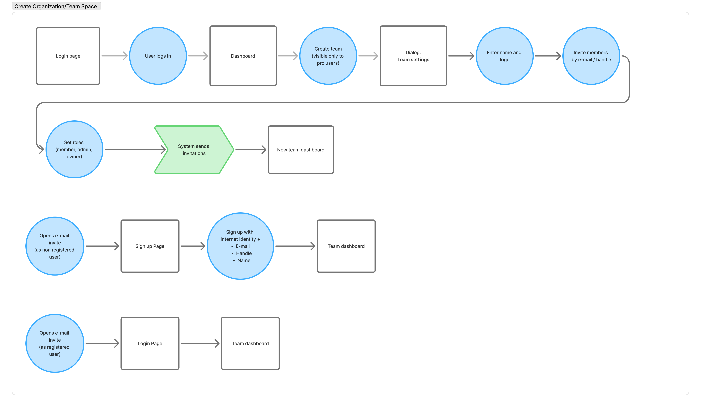
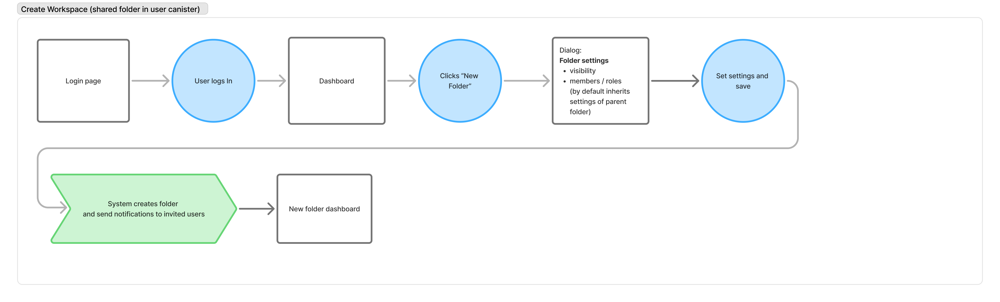
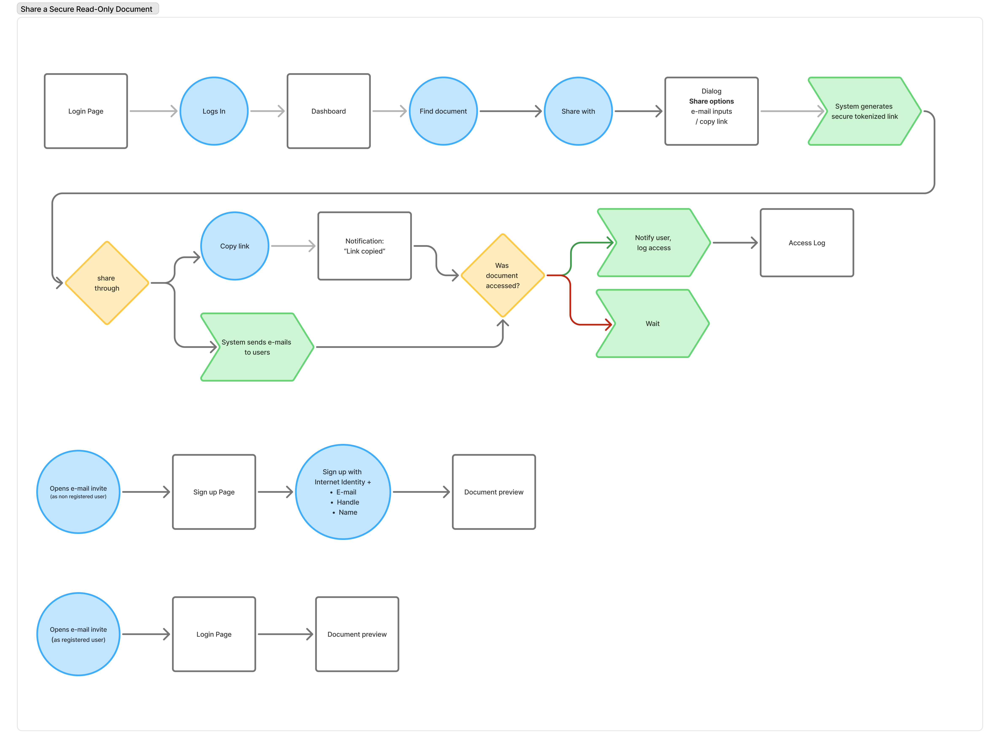
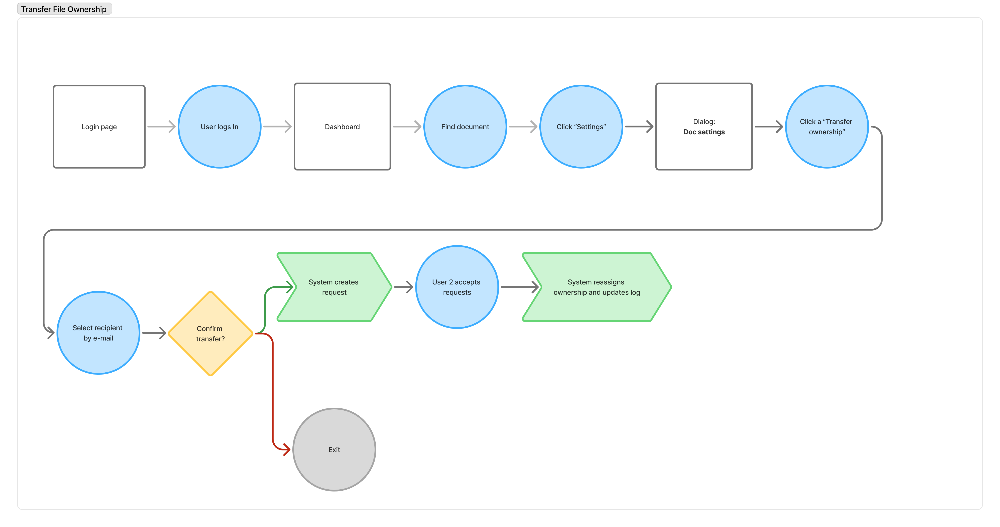
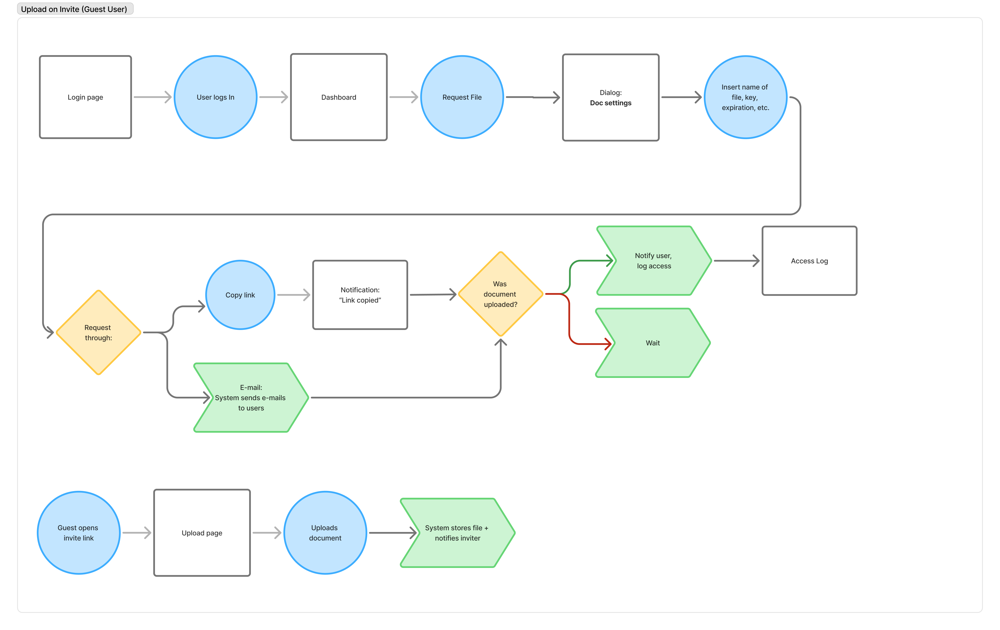

import { Callout } from '@mintlify/components'

User journey maps visualize the complete experience users have when interacting with DocuTrack, from initial discovery through advanced feature usage.

<Info>
  **These journeys are designed around our core personas, ensuring each user type has an optimized path through the platform.**
</Info>

## Journey Mapping Methodology

Our user journeys are built using a persona-first approach:

1. **Persona Goals**: Each journey starts with specific user goals from our defined personas
2. **Touchpoint Analysis**: We identify every interaction point between user and platform
3. **Emotion Mapping**: We track user emotions and frustrations throughout the journey
4. **Optimization Opportunities**: We highlight areas for UX improvements and feature enhancements

## Core User Flows

<Tabs>
  <Tab title="Organization Setup">
    ### 🏢 Create Organization/Team Space

    <Frame>
    
    </Frame>

    This journey enables **enterprise users** like Victoria (COO) and Marcus (Compliance Manager) to establish secure organizational environments. The flow accommodates both new user onboarding and existing user invitation:

    <AccordionGroup>
      <Accordion title="Key Touchpoints" icon="map">
        - **Team Creation**: Pro users can create teams with custom settings and branding
        - **Role Assignment**: Granular permission setting (member, admin, owner)
        - **Invitation System**: Automated email invitations with role-based access
        - **Dual User Paths**: Separate flows for new vs. existing users ensure smooth onboarding
      </Accordion>
      <Accordion title="UX Insights" icon="lightbulb">
        The flow prioritizes institutional confidence with clear role definitions and professional invitation workflows that enterprise users expect.
      </Accordion>
    </AccordionGroup>
  </Tab>
  
  <Tab title="Workspace Creation">
    ### 📁 Create Workspace (Shared Folder)

    <Frame>
    
    </Frame>

    Workspaces provide **secure collaboration spaces** within user canisters, ideal for Elena (Investment Analyst) managing deal documentation or Sarah (Legal Partner) organizing case files:

    <AccordionGroup>
      <Accordion title="Key Features" icon="folder">
        - **Folder Settings Dialog**: Configurable visibility and member permissions
        - **Inheritance Model**: Child folders inherit parent permissions by default
        - **Notification System**: Automated alerts to invited collaborators
        - **Instant Access**: Direct routing to new workspace dashboard
      </Accordion>
      <Accordion title="UX Insights" icon="lightbulb">
        The simplified flow reduces friction while maintaining security controls that professional users require.
      </Accordion>
    </AccordionGroup>
  </Tab>
  
  <Tab title="Document Sharing">
    ### 🔗 Share a Secure Read-Only Document

    <Frame>
    
    </Frame>

    This flow addresses the core use case for **legal and compliance professionals** requiring secure document distribution with audit trails:

    <AccordionGroup>
      <Accordion title="Security Features" icon="shield-check">
        - **Tokenized Links**: System-generated secure links with access controls
        - **Access Logging**: Real-time tracking of document access attempts
        - **User Verification**: Internet Identity integration for recipient authentication
        - **Multiple Share Methods**: Email invitation or direct link copying
      </Accordion>
      <Accordion title="Decision Points" icon="split">
        - **Access Confirmation**: System verifies successful document access
        - **Notification Branching**: Different responses for successful vs. failed access attempts
      </Accordion>
      <Accordion title="UX Insights" icon="lightbulb">
        The flow balances security with usability, providing legal-grade audit trails while maintaining intuitive sharing workflows.
      </Accordion>
    </AccordionGroup>
  </Tab>
  
  <Tab title="Ownership Transfer">
    ### 🔄 Transfer File Ownership

    <Frame>
    
    </Frame>

    Critical for **enterprise succession planning** and legal handovers, this flow ensures secure ownership transfer with proper verification:

    <AccordionGroup>
      <Accordion title="Security Workflow" icon="lock">
        - **Confirmation Dialog**: Clear transfer confirmation prevents accidental ownership changes
        - **Bilateral Approval**: Both parties must confirm the transfer
        - **System Verification**: Backend validation ensures transfer integrity
        - **Audit Trail**: Complete logging of ownership transfer events
      </Accordion>
      <Accordion title="User Protection" icon="shield">
        - **Exit Points**: Users can cancel at multiple stages
        - **Clear Confirmations**: Explicit "Confirm transfer?" decision points
      </Accordion>
      <Accordion title="UX Insights" icon="lightbulb">
        The workflow prioritizes security and reversibility, critical for legal and compliance scenarios where ownership transfers have significant implications.
      </Accordion>
    </AccordionGroup>
  </Tab>
  
  <Tab title="Guest Upload">
    ### 📤 Upload on Invite (Guest User)

    <Frame>
    
    </Frame>

    Enables **external collaboration** without requiring full platform onboarding, perfect for Alex (Privacy-focused Journalist) receiving sensitive documents or clients uploading files to Sarah's legal practice:

    <AccordionGroup>
      <Accordion title="Guest Experience" icon="user-plus">
        - **Streamlined Onboarding**: Minimal required information (name, key, expiration)
        - **Document Verification**: System confirms successful upload
        - **Access Notifications**: Real-time logging for invited user
        - **Multiple Request Methods**: Link sharing or email invitations
      </Accordion>
      <Accordion title="Permission Model" icon="key">
        - **Controlled Access**: Guest users have limited, scoped permissions
        - **Time-bound Access**: Expiration controls for enhanced security
        - **Upload Confirmation**: Clear feedback on successful document submission
      </Accordion>
      <Accordion title="UX Insights" icon="lightbulb">
        The flow reduces barriers for external users while maintaining the security controls that invited users require. The dual-path approach accommodates both link-based and email-based invitations.
      </Accordion>
    </AccordionGroup>
  </Tab>
</Tabs>

---

<Tip>
  **Each journey map identifies key touchpoints, potential friction areas, and opportunities for delightful user experiences.**
</Tip>