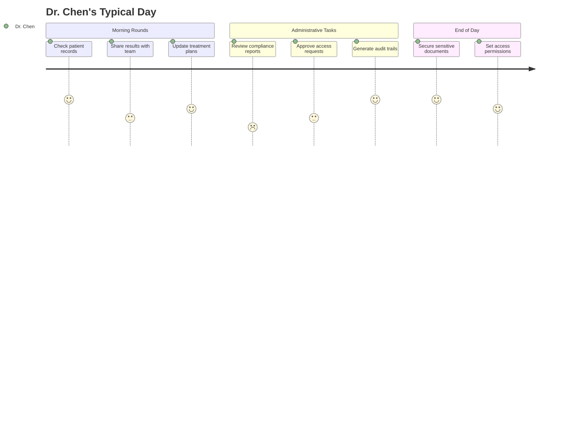
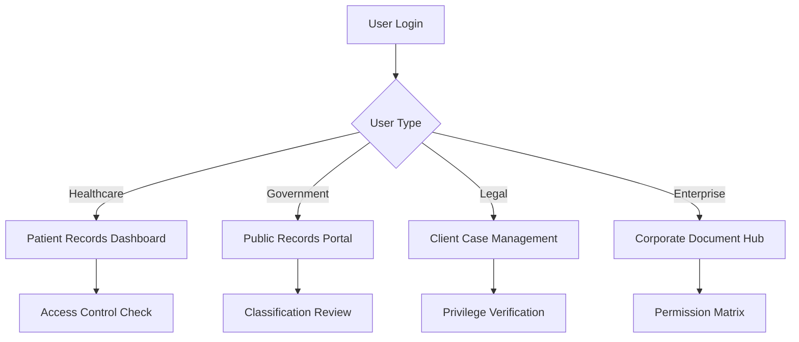

---
title: 'User Personas'
description: 'Detailed user personas for Docutrack target audience'
---

# User Personas

Understanding our users is fundamental to building a product that truly meets their needs. Through extensive research and interviews, we've identified four primary personas that represent our target audience.

## Primary Personas

### 👩‍⚕️ Dr. Sarah Chen - Healthcare Administrator

<Card title="Healthcare Administrator" icon="user-doctor">
**Age**: 42 | **Location**: San Francisco, CA | **Role**: Chief Medical Officer
</Card>

#### Background
Dr. Sarah Chen oversees medical operations at a 200-bed hospital. She's responsible for ensuring HIPAA compliance while maintaining efficient patient care workflows.

#### Goals & Motivations
- **Primary Goal**: Ensure secure, compliant patient record management
- **Secondary Goals**: Improve staff efficiency, reduce administrative overhead
- **Motivations**: Patient safety, regulatory compliance, operational excellence

#### Pain Points
- **Compliance Complexity**: Struggling with HIPAA audit trails and documentation
- **Access Control**: Difficulty managing who can access which patient records
- **System Integration**: Current EMR doesn't integrate well with document sharing needs
- **Security Concerns**: Worried about data breaches and insider threats

#### Technology Profile
- **Tech Savviness**: Moderate to High
- **Primary Devices**: Desktop (work), iPad (rounds), iPhone (personal)
- **Software Familiarity**: EMR systems, Microsoft Office, basic cloud storage

#### Docutrack Usage Scenarios

#### Key Requirements
- **Must Have**: HIPAA compliance, audit trails, role-based access
- **Should Have**: Mobile access, integration APIs, automated retention policies
- **Nice to Have**: Advanced analytics, AI-powered insights

---

### 🏛️ James Rodriguez - Government Compliance Officer

<Card title="Government Compliance Officer" icon="building-columns">
**Age**: 38 | **Location**: Washington, D.C. | **Role**: Senior Compliance Officer
</Card>

#### Background
James works for a federal agency managing public records and ensuring transparency requirements are met while protecting sensitive information.

#### Goals & Motivations
- **Primary Goal**: Maintain transparency while protecting sensitive data
- **Secondary Goals**: Streamline FOIA requests, improve public access
- **Motivations**: Public service, regulatory compliance, government efficiency

#### Pain Points
- **Transparency Balance**: Balancing public access with security requirements
- **Legacy Systems**: Working with outdated document management systems
- **Audit Requirements**: Complex reporting requirements for multiple oversight bodies
- **Public Pressure**: Pressure to provide faster response to information requests

#### Technology Profile
- **Tech Savviness**: Moderate
- **Primary Devices**: Government-issued laptop, secure mobile device
- **Software Familiarity**: Government systems, Microsoft Office, document databases

#### Docutrack Usage Scenarios
- Managing classified document access levels
- Automating FOIA request processing
- Creating comprehensive audit trails
- Coordinating cross-department document sharing

#### Key Requirements
- **Must Have**: Security clearance integration, detailed audit logs, retention policies
- **Should Have**: Automated redaction, public portal integration
- **Nice to Have**: AI-powered classification, predictive compliance

---

### ⚖️ Maria Thompson - Legal Firm Partner

<Card title="Legal Firm Partner" icon="scale-balanced">
**Age**: 45 | **Location**: New York, NY | **Role**: Senior Partner
</Card>

#### Background
Maria leads a 50-person law firm specializing in corporate law. She handles sensitive client documents and needs to ensure attorney-client privilege while enabling team collaboration.

#### Goals & Motivations
- **Primary Goal**: Protect client confidentiality while enabling collaboration
- **Secondary Goals**: Improve case management efficiency, reduce liability
- **Motivations**: Client service excellence, firm profitability, professional reputation

#### Pain Points
- **Client Confidentiality**: Ensuring documents remain privileged and secure
- **Team Collaboration**: Enabling secure collaboration without compromising security
- **Client Expectations**: Clients expect instant access and updates
- **Regulatory Changes**: Keeping up with evolving legal technology requirements

#### Technology Profile
- **Tech Savviness**: Moderate
- **Primary Devices**: Laptop, smartphone, tablet for court appearances
- **Software Familiarity**: Legal research tools, case management systems, Office 365

#### Docutrack Usage Scenarios
- Secure client document sharing during due diligence
- Managing privilege logs and access controls
- Coordinating with external counsel and clients
- Maintaining litigation hold requirements

#### Key Requirements
- **Must Have**: Attorney-client privilege protection, detailed access logs
- **Should Have**: Client portal, mobile access, version control
- **Nice to Have**: Legal hold automation, e-discovery integration

---

### 🏢 David Kim - Enterprise IT Director

<Card title="Enterprise IT Director" icon="building">
**Age**: 41 | **Location**: Seattle, WA | **Role**: Director of Information Technology
</Card>

#### Background
David oversees IT infrastructure for a Fortune 500 company with 10,000+ employees. He's responsible for security, compliance, and enabling business productivity.

#### Goals & Motivations
- **Primary Goal**: Secure, scalable document management across the enterprise
- **Secondary Goals**: Reduce IT costs, improve user experience, ensure compliance
- **Motivations**: Business enablement, risk mitigation, operational efficiency

#### Pain Points
- **Scale Challenges**: Managing document access for thousands of users
- **Integration Complexity**: Need to integrate with existing enterprise systems
- **Security Requirements**: Balancing security with user productivity
- **Budget Constraints**: Pressure to reduce costs while improving functionality

#### Technology Profile
- **Tech Savviness**: High
- **Primary Devices**: Multiple workstations, mobile devices, enterprise tablets
- **Software Familiarity**: Enterprise software, cloud platforms, security tools

#### Docutrack Usage Scenarios
- Enterprise-wide document policy implementation
- Integration with SSO and identity management systems
- Compliance reporting and analytics
- Disaster recovery and business continuity planning

#### Key Requirements
- **Must Have**: Enterprise SSO, scalable architecture, comprehensive APIs
- **Should Have**: Advanced analytics, automated compliance, disaster recovery
- **Nice to Have**: AI-powered insights, predictive analytics, workflow automation

## Secondary Personas

### 👨‍🎓 Academic Researcher

**Profile**: University professor managing research data and publications
**Key Needs**: Collaboration tools, version control, intellectual property protection
**Pain Points**: Grant compliance, international collaboration, data sharing policies

### 🏥 Healthcare Practitioner

**Profile**: Individual doctor or small practice owner
**Key Needs**: Simple HIPAA compliance, patient record sharing, mobile access
**Pain Points**: Cost constraints, limited IT support, time pressures

### 💼 Small Business Owner

**Profile**: Entrepreneur managing business documents and contracts
**Key Needs**: Affordable solution, easy setup, basic compliance features
**Pain Points**: Limited budget, minimal IT expertise, growth scalability

## Persona-Driven Feature Prioritization

Based on our persona research, we've prioritized features according to user needs:

<AccordionGroup>
  <Accordion title="High Priority Features">
    - **Multi-level access control** (All personas)
    - **Comprehensive audit trails** (Healthcare, Government, Legal)
    - **Mobile accessibility** (All personas)
    - **Integration capabilities** (Enterprise, Healthcare)
  </Accordion>
  
  <Accordion title="Medium Priority Features">
    - **Advanced search and filtering** (Legal, Academic)
    - **Automated compliance reporting** (Healthcare, Government)
    - **Client/public portals** (Legal, Government)
    - **Workflow automation** (Enterprise, Healthcare)
  </Accordion>
  
  <Accordion title="Future Enhancements">
    - **AI-powered document classification** (All personas)
    - **Predictive compliance alerts** (Healthcare, Government)
    - **Advanced analytics dashboard** (Enterprise, Legal)
    - **Voice-to-text integration** (Healthcare, Legal)
  </Accordion>
</AccordionGroup>

## User Journey Mapping

Each persona follows distinct paths through Docutrack:

This persona-driven approach ensures that Docutrack meets the specific needs of each user group while maintaining a consistent, secure experience across all use cases.