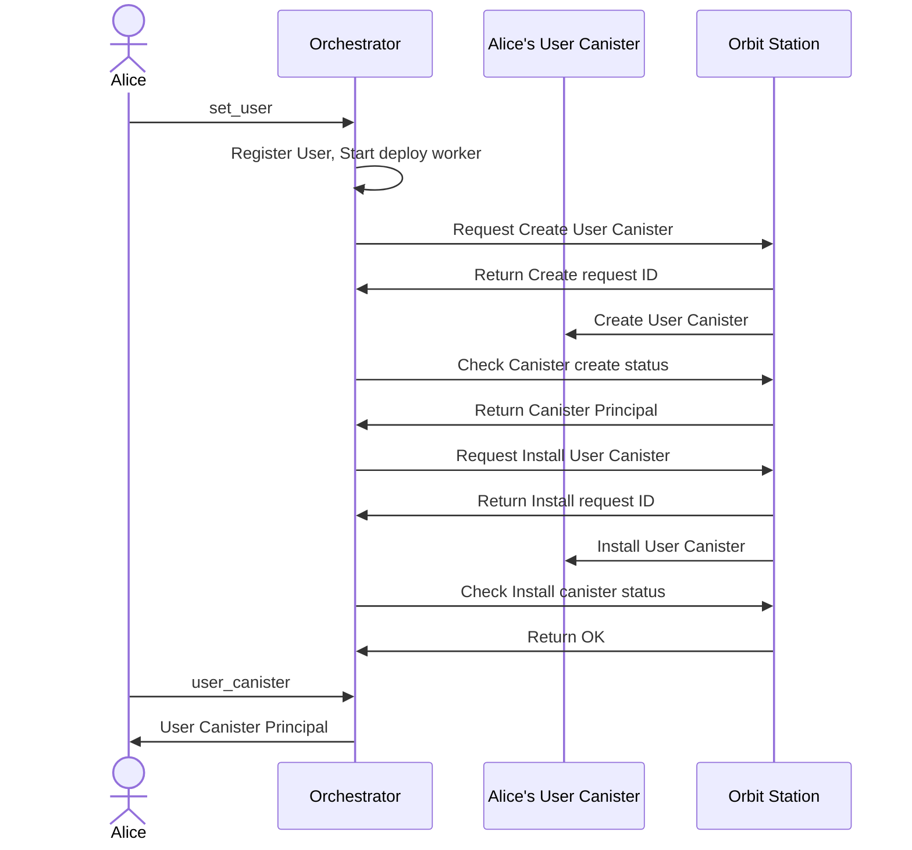

## Create a new user canister

```mermaid
sequenceDiagram
    actor U as Alice
    participant O as Orchestrator
    participant UC as Alice's User Canister
    participant OS as Orbit Station
    U->>O: set_user
    O->>O: Register User, Start deploy worker
    O->>OS: Request Create User Canister
    OS->>O: Return Create request ID
    OS->>UC: Create User Canister
    O->>OS: Check Canister create status
    OS->>O: Return Canister Principal
    O->>OS: Request Install User Canister
    OS->>O: Return Install request ID
    OS->>UC: Install User Canister
    O->>OS: Check Install canister status
    OS->>O: Return OK
    U->>O: user_canister
    O->>U: User Canister Principal

```