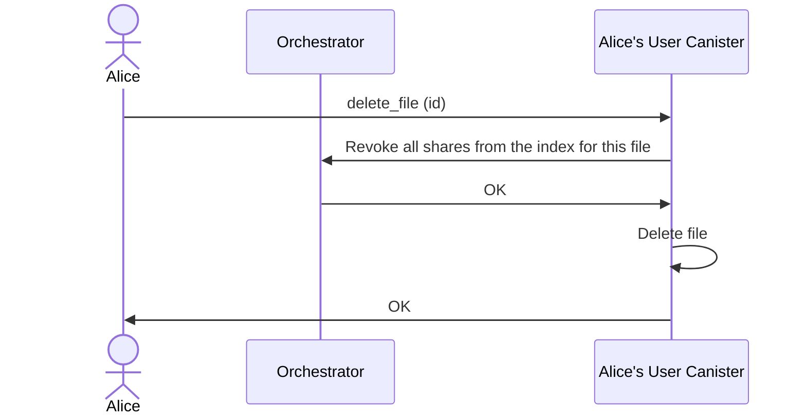

```mermaid
sequenceDiagram
    actor A as Alice
    participant O as Orchestrator
    participant UC as Alice's User Canister
    A->>UC: delete_file (id)
    UC->>O: Revoke all shares from the index for this file
    O->>UC: OK
    UC->>UC: Delete file
    UC->>A: OK
```
