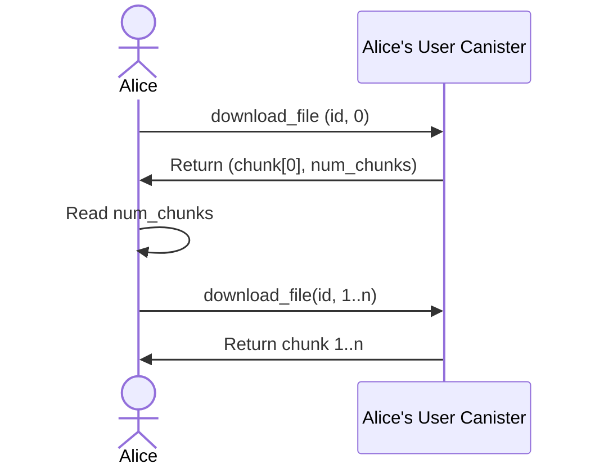
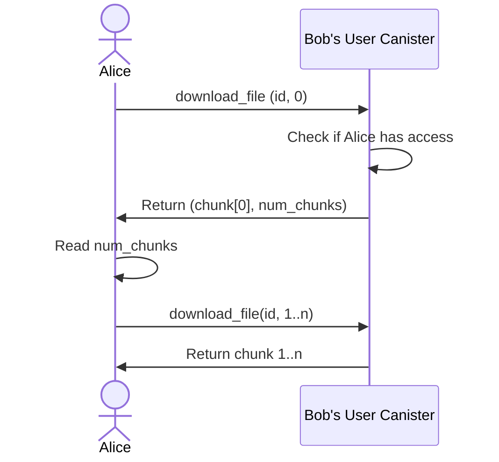

## Download a document

```mermaid
sequenceDiagram
    actor A as Alice
    participant UC as Alice's User Canister
    A->>UC: download_file (id, 0)
    UC->>A: Return (chunk[0], num_chunks)
    A->>A: Read num_chunks
    A->>UC: download_file(id, 1..n)
    UC->>A: Return chunk 1..n

```

If Alice has access to a shared file owned by Bob, she can download it in the same way:

```mermaid
sequenceDiagram
    actor A as Alice
    participant UC as Bob's User Canister
    A->>UC: download_file (id, 0)
    UC->>UC: Check if Alice has access
    UC->>A: Return (chunk[0], num_chunks)
    A->>A: Read num_chunks
    A->>UC: download_file(id, 1..n)
    UC->>A: Return chunk 1..n

```