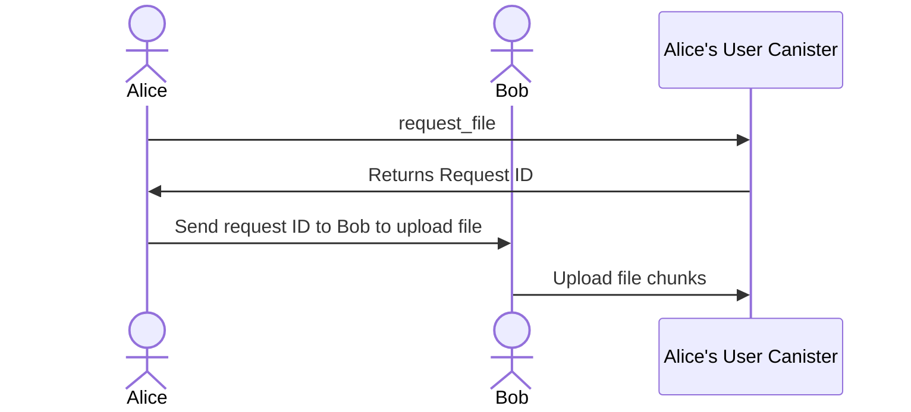

Whoever has the request ID can upload the file chunks.

```mermaid
sequenceDiagram
    actor A as Alice
    actor B as Bob
    participant UC as Alice's User Canister
    A->>UC: request_file
    UC->>A: Returns Request ID
    A->>B: Send request ID to Bob to upload file
    B->>UC: Upload file chunks

```