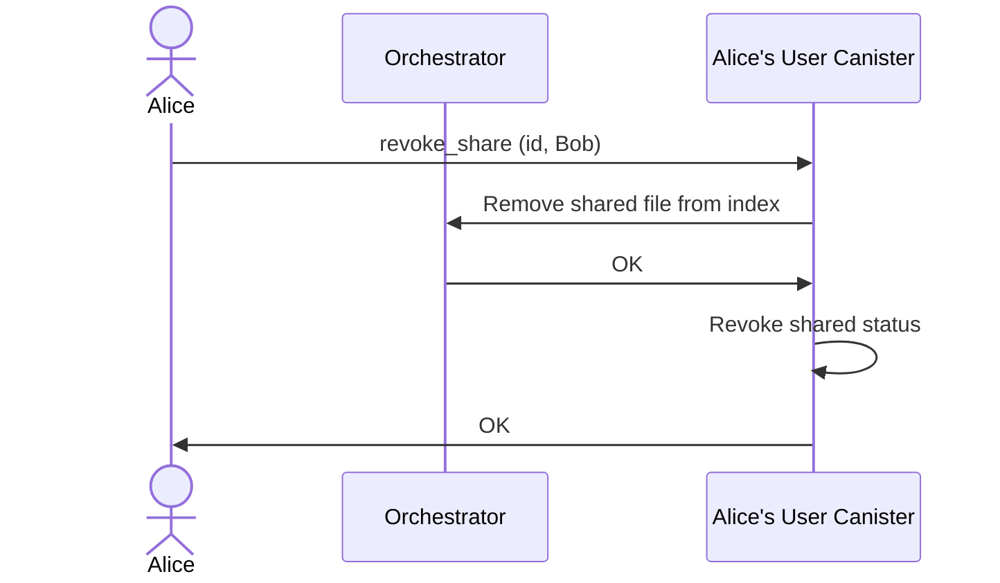

```mermaid
sequenceDiagram
    actor A as Alice
    participant O as Orchestrator
    participant UC as Alice's User Canister
    A->>UC: revoke_share (id, Bob)
    UC->>O: Remove shared file from index
    O->>UC: OK
    UC->>UC: Revoke shared status
    UC->>A: OK

```
