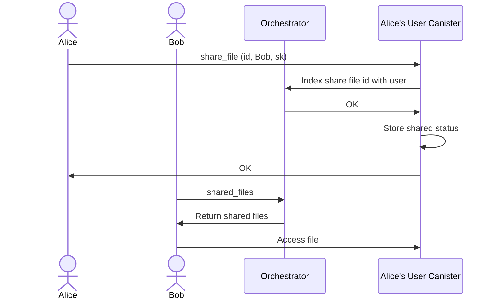

```mermaid
sequenceDiagram
    actor A as Alice
    actor B as Bob
    participant O as Orchestrator
    participant UC as Alice's User Canister
    A->>UC: share_file (id, Bob, sk)
    UC->>O: Index share file id with user
    O->>UC: OK
    UC->>UC: Store shared status
    UC->>A: OK
    B->>O: shared_files
    O->>B: Return shared files
    B->>UC: Access file

```