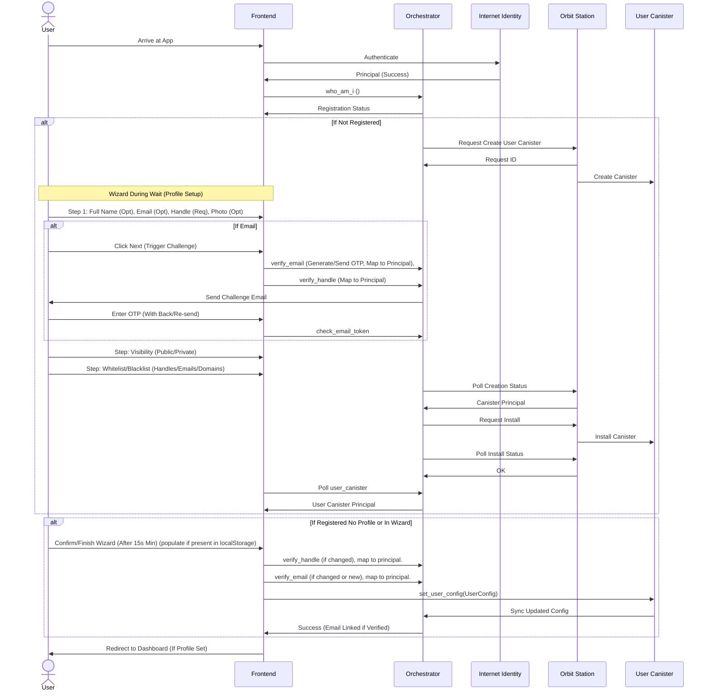
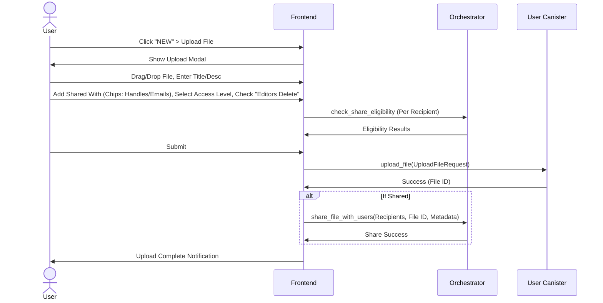
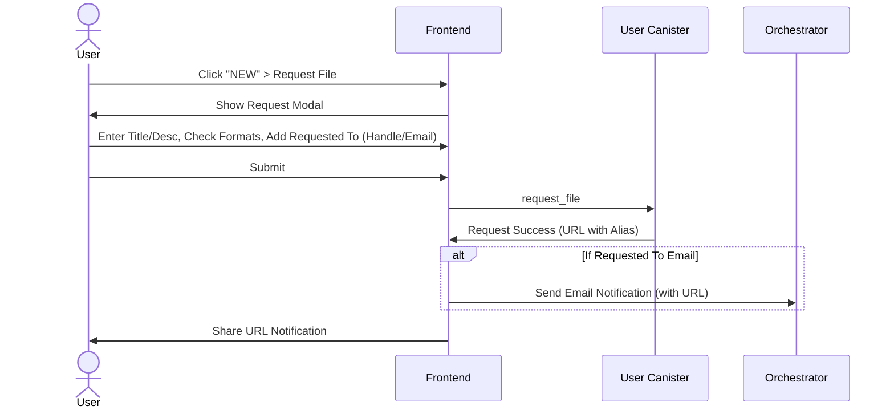
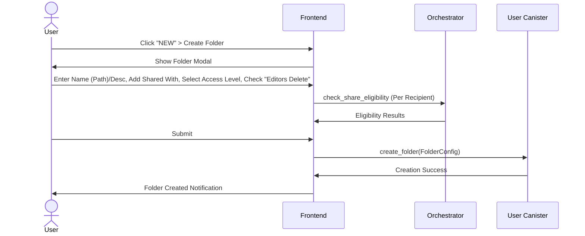
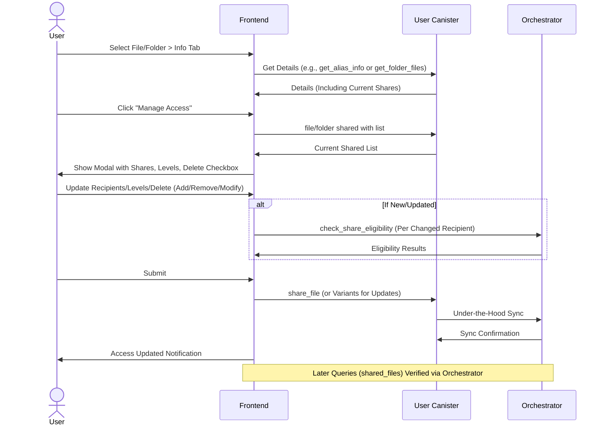

### Deliverable List

- Technical document describing the available canister endpoints, the related data structures, and the interaction logic between them.
- Repository containing the full canister codebase, including clear and reproducible deployment instructions.
- Link to deployed canisters to allow independent testing of uploading and deleting a file
- Detailed document mapping all user journeys, with a focus on the registration and sharing processes.
- Figma prototype, showcasing the proposed new user experience for registration and sharing, integrating both existing and newly designed features.

#### DocuTrack User Journeys Documentation

The focus is on core processes like registration and sharing, incorporating enhanced features such as email verification, visibility configurations and access levels. Journeys are described in a step-by-step format, including:

- User Actions: What the user does.
- System Responses: Backend interactions (e.g., canister calls).
- UI/UX Elements: Frontend guidance, wizards, and timing considerations.
- Edge Cases/Validations: Potential issues and handling.
  Sequence Diagrams: Mermaid-based visualizations for clarity.
- Dependencies: Ties to Candid interfaces (orchestrator, user canister).

Journeys align with ICP principles (e.g. authentication via Internet Identity) and address UX optimizations like parallel processing during canister creation waits.

Starting with the **User Registration Journey**, as specified. Subsequent journeys (e.g., file sharing) will be added iteratively.

## User Registration

**Journey Description**: This journey covers the end-to-end process for a new user to register in DocuTrack. It begins with authentication and ends with a fully configured user profile and dedicated user canister. The process leverages Internet Identity, followed by profile setup and canister provisioning via the orchestrator along with Orbit in parallel executions. To enhance UX during the potentially lengthy canister creation (due to Orbit Station interactions), a guided wizard allows parallel configuration, including optional email verification. The encouraged visibility is public, but users can opt for private settings with granular controls.

### Step-by-Step Journey:

1. **Arrival and Authentication**:

-- **User Action**: User arrives at the DocuTrack app. They are prompted to authenticate via Internet Identity as the sole entry point.

-- **System Response**: Frontend triggers II login. Upon success, retrieves the user's principal and calls `who_am_i` on the orchestrator canister with the authenticated principal. Orchestrator checks whether that principal is registered in the registry:

- If the user exists and profile is set: Redirect to user dashboard.
- If the user exists but no profile is set: Show set profile form (proceed to Initial Profile Setup).
- If not registered: Trigger user canister creation via Orbit Station (starts deploy worker), no further details requested at this point.

-- **UI/UX Elements**: Full-screen modal: "Welcome to DocuTrack! Authenticate with Internet Identity to get started." Includes a brief intro: "DocuTrack is your decentralized file management app—secure, private, and powered by ICP."

-- **Edge Cases/Validations**: If II fails, display error: "Authentication required. Please set up Internet Identity." If who_am_i indicates failure or unexpected state, gracefully handled (e.g., retry or error message).

2. **Initial Profile Setup (If Profile Not Set)**:

-- **User Action**: If profile not set (from who_am_i), user is shown the profile setup wizard during the canister creation wait (if creation triggered) or immediately.

-- **System Response**: If creation triggered, orchestrator polls Orbit Station for status. Config data cached client-side during wait.

-- **UI/UX Elements**: Wizard modal opens automatically during wait (or on load if no creation needed). Enforce at least 15 seconds engagement.

3. **Canister Creation Wait Period and Wizard (If Creation Triggered)**:

-- **User Action**: Interact with wizard to set profile.

-- **System Response**: Polling continues in background. Configs temp-stored until canister ready.

-- **UI/UX Elements**: Multi-step wizard:

- **Step 1: Profile Details** - "Let's set up your profile while your canister is created!" Fields: Full Name (encouraged but optional), Email (encouraged but optional, unique via `email_exists` check), Handle (required, unique via `username_exists`), Photo (optional, with 2MB size limit—client-side validation).

  - Real-time validation and tooltips: "Handle is your unique username." "Email enables advanced sharing—verification required."

- **If Email Provided: Step 2: Email Verification** - On 'Next' button click, trigger challenge. User inputs OTP.

  - Buttons: 'Next' (sends challenge `verify_email`, also seting user handle through `verify_handle` _is triggered even if no email was setted_), 'Back' (edit profile), 'Re-send Token' (rate-limited).

- **Step 3 (or 2 if no email): Visibility Settings** - Choose Public (default, anyone can share/find you) or Private (granular control).

  - Checkbox/radio: "Make my profile private."

- **Step 4 (or 3 if no email)**: Whitelist/Blacklist - Inputs for allowed/blocked: Handles, emails, or wildcard domains (e.g., \*@example.com treated as domain wildcard).

  - Multi-select chip inputs: Add/remove values.

- Tutorial slides integrated for education.

-- **Edge Cases/Validations**: If wizard closed, save drafts in localStorage. Photo over 2MB: Error and compress suggestion. Invalid inputs: Block 'Next'.

4. **Parallel Email Challenge (If Email Provided)**:

-- **User Action**: Enter OTP in wizard.

-- **System Response**: On 'Next', call `verify_email` (generate/send OTP, map to principal in orchestrator). On submit, call `check_email_token`.

-- **UI/UX Elements**: "Code sent to [email]. Enter here:" With input, 'Back', 'Re-send' (rate-limited).

-- **Edge Cases/Validations**: Invalid code: "Try again." Duplicate email: Block in Step 1. Timeout: 5min, allow retry.

5. **Canister Creation Success and Config Finalization**:

-- **User Action**: Confirm and submit wizard on 'Finish'.

-- **System Response**: Orchestrator returns canister principal. Frontend calls `set_user_config` on user canister with UserConfig (includes full_name, email, handle, photo, visibility, whitelist/blacklist). Sync to orchestrator. If email verified, link it.

-- **UI/UX Elements**: Success: "Canister ready! Profile set." Redirect to dashboard with tutorial.

-- **Edge Cases/Validations**: Creation fail: Call `retry_user_canister_creation`. Config saved in local storage and temporary cached in orchestrator (email, email verification, and handle mapped to the principal).

### Sequence Diagram

## Upload file

**Journey Description:** This journey allows a registered user to upload a file from their dashboard. It starts with selecting the upload option via a context menu and includes features like drag-and-drop, sharing configurations, access levels, and an optional "editors can delete" flag. The process leverages the user canister for storage, with sharing handled via the orchestrator for eligibility checks.

**Key Goals:**

Flexible sharing (handles/emails) and access controls.
Enhance UX with intuitive inputs like chips and drag-and-drop.

**Prerequisites:**

User is authenticated via Internet Identity and has a user canister (from registration).
Dashboard access: Displays existing files/folders.

### Step-by-Step Journey:

#### Initiate Upload

-- **User Action:** From the dashboard, click the top-right "NEW" button to expand a context menu. Select "Upload File".

-- **System Response:** Frontend prepares an upload modal/component.

-- **UI/UX Elements:** Context menu with options: Upload File, Create Folder, Request File. Modal title: "Upload New File".

-- **Edge Cases/Validations:** If no user canister, redirect to registration/status check.

#### File Selection and Details

-- **User Action:** Drag-and-drop file(s) into the component or browse to select. Enter title (file name), optional description.

-- **System Response:** Client-side validation (e.g., file size limits, formats). Prepares UploadFileAtomicRequest (path, ?note,
content,
owner_key,
file_type,
num_chunks).

-- **UI/UX Elements:** Drag-and-drop zone with feedback (e.g., "Drop files here"). Inputs: Text field for title, textarea for description.

-- **Edge Cases/Validations:** Unsupported formats? Show warning. Size exceeds ICP limits? Chunk and warn.

#### Sharing and Access Configuration

-- **User Action:** In "Shared With" input, add recipients via chips (handles or emails). Select access level from dropdown (Viewer, Editor, E-Signer). Check "Editors can delete" if desired.

-- **System Response:** For each recipient, check eligibility via orchestrator's `check_share_eligibility`. If sharing, prepare ShareFileMetadata.

-- **UI/UX Elements:** Chip input: Autocomplete for handles(if public), add/remove chips. Dropdown: Access levels with tooltips (e.g., "Editor: Can download, edit, upload versions"). Checkbox: "Allow Editors to Delete File" (enables `delete_file` for Editors).

-- **Edge Cases/Validations:** Invalid recipient? Highlight chip red with error.

#### Upload and Share Execution

-- **User Action:** Submit the form.

-- **System Response:** Call `upload_file_atomimc` on user canister. On success, if shared, call share_file or share_file_with_users with metadata (including access_level, delete flag implied in access).

-- **UI/UX Elements:** Progress bar for upload. Success toast: "File uploaded and shared successfully."

-- **Edge Cases/Validations:** Upload fails? Retry chunks. Sharing revoked? Handle via error.

#### Sequence Diagram:

## Request File

**Journey Description:** This journey enables a user to request a file from another (registered or unregistered user). It uses a form for details and generates a shareable request URL (alias-based). "Requested To" is syntactic sugar: For handles, direct share; for emails, send notification. Always ties to the `request_file` endpoint on the user canister.

### Key Goals:

Simplify file requests with format restrictions and easy sharing.
Support non-registered users via email or link sharing.

**Prerequisites:**

User is authenticated and in dashboard.

### Step-by-Step Journey:

#### Initiate Request

-- **User Action:** Click "NEW" > "Request File".

-- **System Response:** Prepare request modal.

-- **UI/UX Elements:** Modal: "Request a File".

#### Request Details

-- **User Action:** Enter title (equiv file name), description. Select accepted formats via checkboxes (PDF, DOC, JPEG, PNG, MP4). Add "Requested To" (handle/email).

-- **System Response:** Generate alias for request.

-- **UI/UX Elements:** Text inputs for title/desc. Checkboxes for formats. Input for "Requested To" (chips if multiple).

--- **Edge Cases/Validations:** No formats selected? Default to all.

#### Submit and Share Request

-- **User Action:** Submit.

-- **System Response:** Call `request_file` on user canister (alias as text). If "Requested To" is email, send notification with URL; if handle, share directly.

-- **UI/UX Elements:** Generate URL: "Share this link: [URL with alias]". Copy button.

--- **Edge Cases/Validations:** Invalid email? Validate format. Visibility/Eligibility checks.

#### Sequence Diagram:

## Create Folder

**Journey Description:** This journey lets users create a folder (S3-like prefix path) with sharing and access configs.

#### Key Goals:

- Structured file management with inherited sharing.

**Prerequisites:**

Authenticated user in dashboard.

### Step-by-Step Journey:

#### Initiate Creation

-- **User Action:** Click "NEW" > "Create Folder".

-- **System Response:** Prepare modal.

-- **UI/UX Elements:** Modal: "Create New Folder".

#### Folder Details

-- **User Action:** Enter folder name (prefix path), description. Add "Shared With" (chips: handles/emails). Select access level. Check "Editors can delete".
-- **System Response:** Prepare FolderConfig.

-- **UI/UX Elements:** Path input (e.g., "/myfolder/" ). Chips/dropdown/checkbox as in upload.

-- **Edge Cases/Validations:** Path conflicts? Check existing.

#### Create Execution

-- **User Action:** Submit.

-- **System Response:** Call `create_folder(FolderConfig)` on user canister.

-- **UI/UX Elements:** Success: "Folder created."

-- **Edge Cases/Validations:** Invalid config? Error.

#### Sequence Diagram

## Managing Access (Files and Folders)

**Journey Description:** This journey allows a registered user to manage access for existing files or folders after their initial creation or upload. It involves viewing detailed info for a file/folder, opening a management modal to update sharing details, and adjusting access levels or delete permissions for already shared recipients. The UI mirrors the creation/upload interfaces for consistency. Access changes trigger sharing updates on the user canister, with under-the-hood synchronization to the orchestrator. Eligibility checks occur only during initial sharing or updates, and prior shares remain unaffected by recipient visibility changes. Shared files are verified via the orchestrator when querying "files shared with me."

### Key Goals:

Enable post-creation access management for files and folders without disrupting existing shares.
Provide a familiar UI for updating recipients, access levels, and delete permissions.
Ensure synchronization between user canister and orchestrator for accurate shared file queries.

**Prerequisites:**

User is authenticated via Internet Identity and has a user canister.
Dashboard access with existing files/folders (e.g., from upload or create folder journeys).
File/folder is selected (e.g., via list view).

### Step-by-Step Journey:

#### Access File/Folder Details

-- **User Action:** In the dashboard, select a file or folder and navigate to its information tab (e.g., click "Info" icon).

-- **System Response:** Fetch details from user canister (e.g., via `shared_files` or `get_folder_files`).

-- **UI/UX Elements:** Detail view panel/tab showing metadata (name, description, current shares). Includes a "Manage Access" button.

-- **Edge Cases/Validations:** If no shares, display "Not shared yet." Ensure user owns the item (caller principal check).

### Open Manage Access Modal

-- **User Action:** Click "Manage Access" button.

-- **System Response:** Retrieve current shared list (e.g., via `shared_files` on orchestrator).

-- **UI/UX Elements:** Modal opens: "Manage Access for [File/Folder Name]". Displays list of already shared users (chips for handles/emails) with dropdown for access level (Viewer, Editor, E-Signer) and checkbox for "Editors can delete".

-- **Edge Cases/Validations:** Load existing configs; disable edits if not owner.

### Update Sharing and Access

-- **User Action:** Add/remove recipients via chips, update access levels via dropdown, toggle delete checkbox. Can add new shares or modify existing. (eligibility checks).

-- **System Response:** For new/updated recipients, perform `check_share_eligibility` via orchestrator. No re-check for unchanged shares.

-- **UI/UX Elements:** Chip input with autocomplete (similar to upload/create). Dropdown and checkbox per recipient. Tooltips: "Updating access will re-share with new settings."

-- **Edge Cases/Validations:** If recipient visibility changed post-initial share, ignore—prior access persists. Invalid update? Error on chip.

#### Apply Changes and Sync

-- **User Action:** Submit the modal.

-- **System Response:** Call `share_file` (or variants) on user canister for updates. Under-the-hood sync to orchestrator (e.g., for revocation or new shares). If revoking, use revoke_share. Shared views (e.g., "files shared with me") verified via orchestrator's `shared_files`.

-- **UI/UX Elements:** Progress indicator. Success toast: "Access updated successfully."

#### Sequence Diagram

